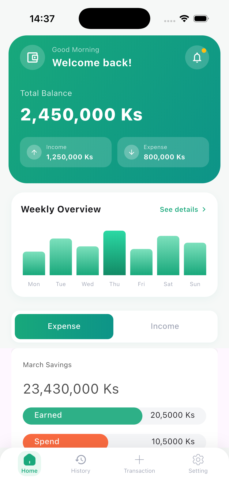
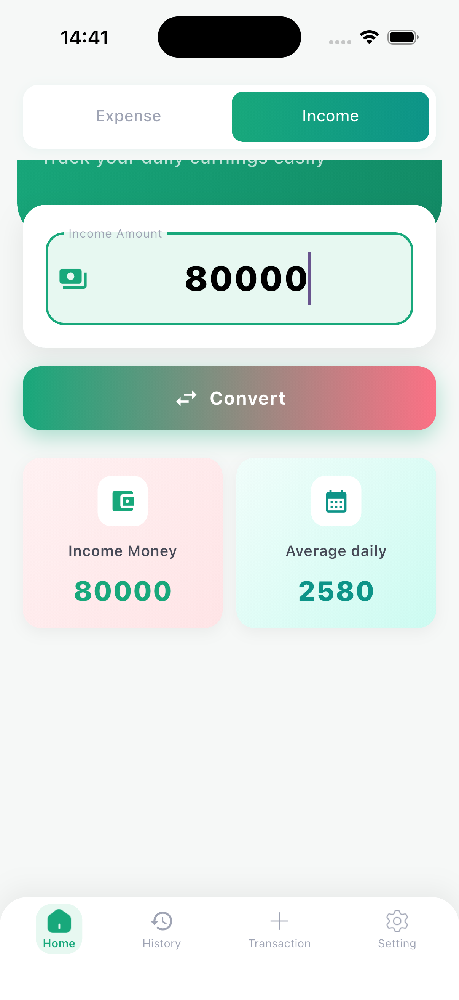
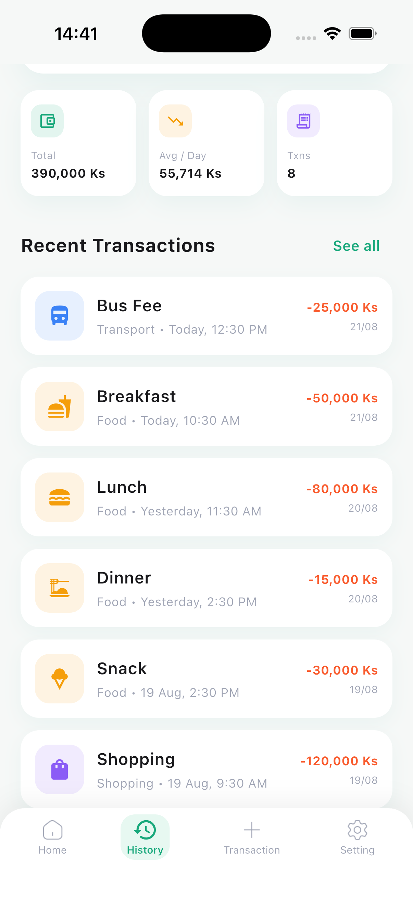
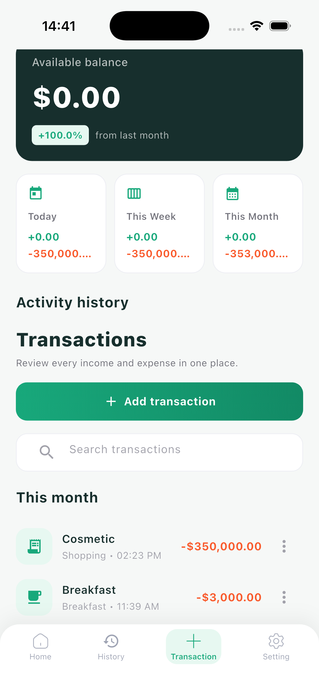
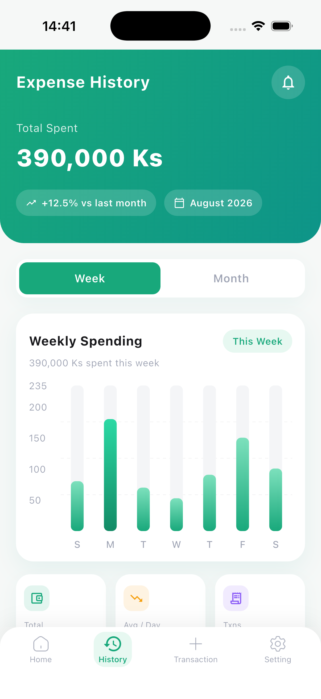
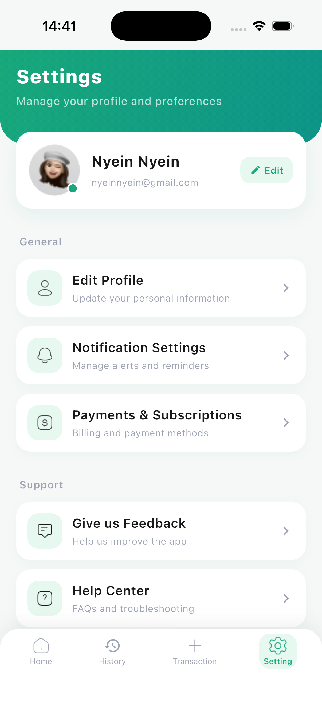

# PocketWise - Expense Tracker

A beautiful and intuitive expense tracking app built with Flutter. Track your income and expenses, visualize spending patterns, and manage your finances with ease.

---

## Screenshots

| Dashboard | Income Tracker | Transaction |
|:---:|:---:|:---:|
|  |  |  |

| History | Stats | Settings |
|:---:|:---:|:---:|
|  |  |  |

---

## Features

- **Dashboard** - Overview of total balance, income, and expenses with a weekly bar chart
- **Transaction Management** - Add, view, search, and delete income/expense transactions
- **Expense History** - Bar chart visualization of weekly/monthly spending with stats
- **Income Tracker** - Track daily earnings with income-to-currency conversion
- **Category Support** - Organize transactions by category (Food, Transport, Health, etc.)
- **Monthly Budget** - Set and monitor monthly spending limits with progress bars
- **Profile & Settings** - User profile management and app preferences
- **Attractive UI** - Floating pill bottom navigation with smooth animations

---

## Tech Stack

| Technology | Purpose |
|---|---|
| **Flutter** | Cross-platform UI framework |
| **GetX** | State management & dependency injection |
| **Floor** | Local SQLite database with reactive streams |
| **fl_chart** | Bar chart visualizations |
| **intl** | Date formatting and localization |

---

## Project Structure

```
lib/
├── main.dart                    # App entry point
├── controller/                  # GetX controllers
│   ├── base_controller.dart         # Navigation & notification state
│   ├── add_transaction_controller.dart  # Transaction CRUD logic
│   ├── expense_controller.dart      # Expense list & summary
│   ├── income_controller.dart       # Income tracking
│   └── money_come_out_controller.dart   # Income/Expense tab controller
├── database/                    # Floor database
│   └── app_database.dart            # Database, DAOs, entities
├── model/                       # Data models
│   ├── expense_model.dart           # Expense data model
│   ├── category_model.dart          # Category definitions
│   └── individual_bar_model.dart    # Chart bar data
├── screen/                      # UI screens
│   ├── bottom_navigation.dart       # Custom animated bottom nav
│   ├── daily_expense/
│   │   └── add_expense.dart         # Transaction management screen
│   ├── history/
│   │   ├── bar_chart.dart           # Expense history with charts
│   │   └── bar_graph.dart           # Bar graph widget
│   ├── income/
│   │   ├── money_come_out.dart      # Dashboard home screen
│   │   ├── expense.dart             # Expense list tab
│   │   └── income.dart              # Income list tab
│   └── settings/
│       └── profile_setting.dart     # Profile & settings screen
├── helper/                      # Utilities & constants
│   ├── app_constant.dart            # Colors, fonts, API URLs
│   └── extensions.dart              # String/num formatting extensions
└── generated/                   # Auto-generated code
    └── assets.dart                  # Asset path references
```

---

## Getting Started

### Prerequisites

- Flutter SDK `>=3.2.3 <4.0.0`
- Dart SDK
- Android Studio / VS Code
- iOS Simulator / Android Emulator

### Installation

1. **Clone the repository**
   ```bash
   git clone https://github.com/your-username/expense_tracker.git
   cd expense_tracker
   ```

2. **Install dependencies**
   ```bash
   flutter pub get
   ```

3. **Generate Floor database code**
   ```bash
   dart run build_runner build
   ```

4. **Run the app**
   ```bash
   flutter run
   ```

---

## Key Dependencies

| Package | Version | Description |
|---|---|---|
| `get` | ^4.6.6 | State management |
| `floor` | ^1.4.2 | SQLite database ORM |
| `fl_chart` | ^0.68.0 | Charts and graphs |
| `intl` | ^0.19.0 | Date/number formatting |
| `shared_preferences` | ^2.2.3 | Local storage |
| `connectivity_plus` | ^6.0.3 | Network status |
| `table_calendar` | ^3.1.1 | Calendar widget |

---

## Database

The app uses **Floor** for local data persistence with the following entities:

- **Expense** - id, name, amount, category, income/outcome, date, color, icon
- **Transaction** - id, name, income/outcome amount, category, createdAt

---

## Color Palette

| Color | Hex | Usage |
|---|---|---|
| Primary Green | `#18A87B` | Buttons, active states |
| Dark Base | `#172F2D` | Headers, balance cards |
| Page Background | `#F6F8F7` | Screen background |
| Green Tint | `#E7F8F1` | Light green accents |
| Text Hint | `#9FA4B4` | Secondary text |

---

## License

This project is for personal/educational use.

---

Built with Flutter
